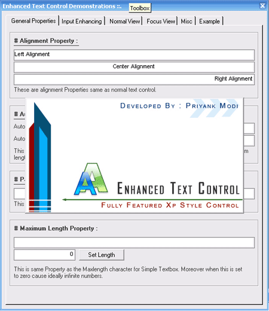



## Enhanced Text Control

### Description

Enhanced Text Control is Fully Featured Xp Style(.NET TYPE) control. Its has 20+ PROPERTIES which include Normal-Focus Views, Auto selection, Auto TABing and Enter key TABing, Input filtering and Formatting. SEE ANIMATED SCREENSHOT. Make sure to download specially for practical application which more depend on easy and stylish design. Feel free use in your application. Pls have your valuable vote if you really like this Control.

You must see once...
 
### More Info
 
Visite : http://www.geocities.com/priyank_modi/

             |
---                |---
**Submitted On**   |2006-03-24 12:02:48
**By**             |[Priyank Modi](https://github.com/Planet-Source-Code/PSCIndex/blob/master/ByAuthor/priyank-modi.md)
**Level**          |Intermediate
**User Rating**    |4.9 (182 globes from 37 users)
**Compatibility**  |VB 6\.0
**Category**       |[OLE/ COM/ DCOM/ Active\-X](https://github.com/Planet-Source-Code/PSCIndex/blob/master/ByCategory/ole-com-dcom-active-x__1-29.md)
**World**          |[Visual Basic](https://github.com/Planet-Source-Code/PSCIndex/blob/master/ByWorld/visual-basic.md)
**Archive File**   |[Enhanced\_T1983143262006\.zip](https://github.com/Planet-Source-Code/priyank-modi-enhanced-text-control__1-64582/archive/master.zip)

